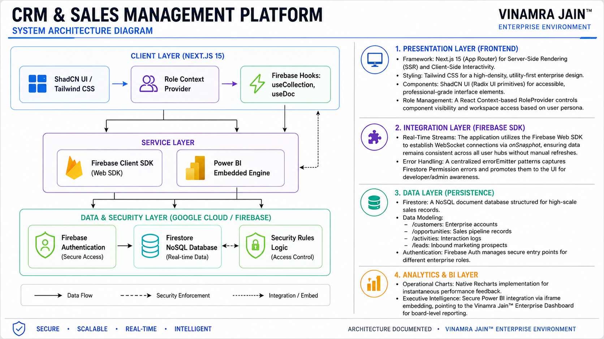
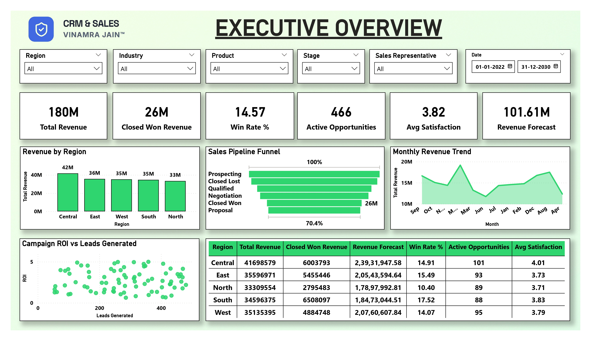
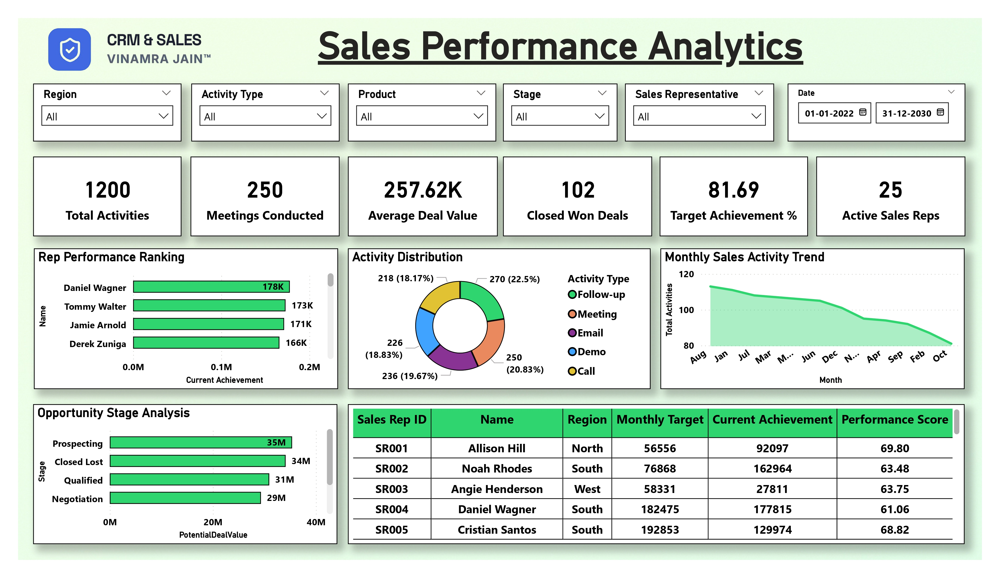
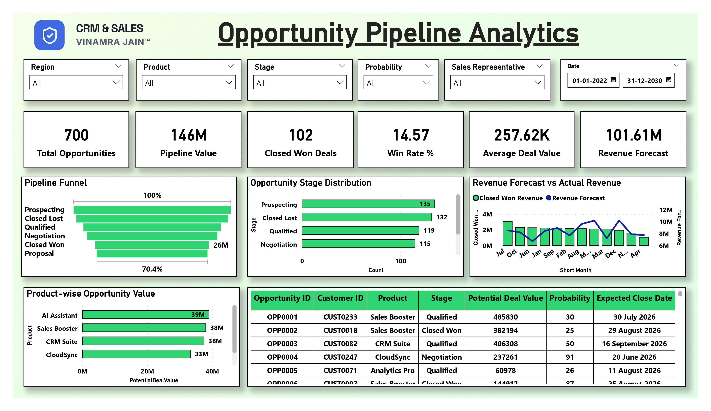
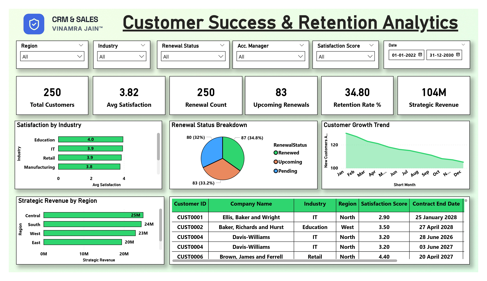
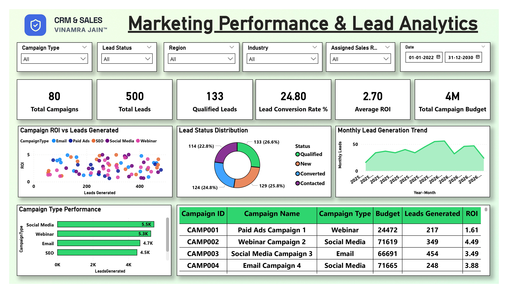
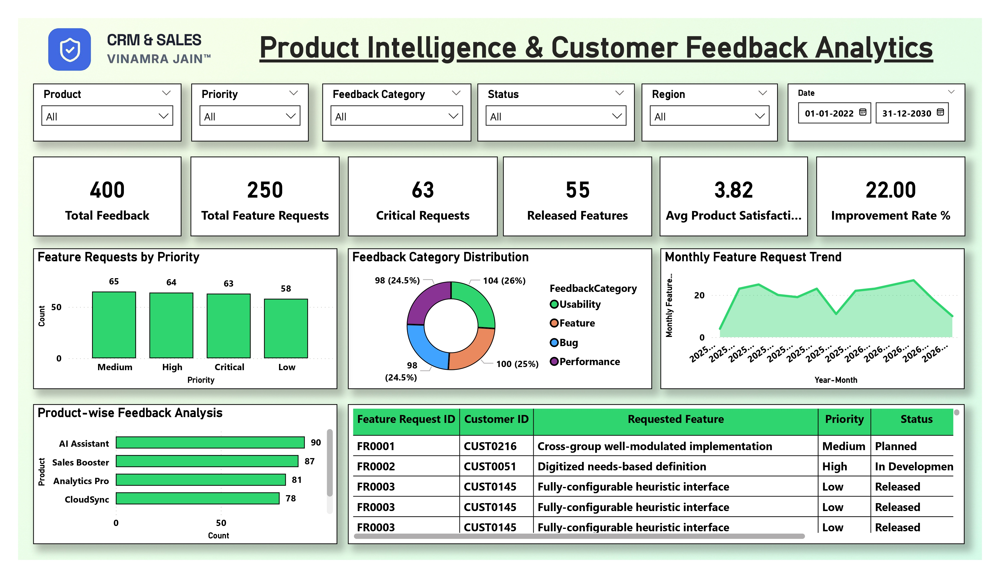

# CRM & Sales Management Project Documentation

— Vinamra Jain

# Project Background

The CRM and Sales Management platform is a business tool made by Vinamra Jain. It helps companies manage their sales, customers and marketing. The platform brings all the business functions together in one place using real-time data and insights.

- It helps with sales operations, customer engagement and making decisions.
- The platform is designed to be scalable, collaborative and fast.

The system helps organizations manage the customer journey. This includes:

- Getting leads
- Tracking opportunities
- Keeping customers
- Predicting revenue

The platform combines efficiency with analytics. This allows teams to make decisions based on data.

The project is built around user roles. Each department gets an experience that fits their needs and goals. For example:

- Sales reps can manage their pipelines and activities.
- Managers can monitor team performance and approvals.
- Account managers can build relationships with customers.
- Marketers can see how well their campaigns are doing.
- Executives can access dashboards and insights.

The platform uses technologies like:

- Next.js 15
- Firebase Firestore
- Firebase Authentication
- Tailwind CSS
- ShadCN UI
- Power BI Analytics

These technologies provide:

- Secure login
- Real-time data
- User-friendly interfaces
- Advanced reporting

The system is more, than just a CRM. It's a tool that helps executives make decisions. By bringing together sales, customer and product data the platform helps organizations:

- Work efficiently
- Make customers happier
- Grow their business sustainably

---

# Requirement Overview

The CRM and Sales Management platform needs a system that can handle everything in one place. This includes managing sales, customer relationships, marketing information, product feedback and reports for executives. The system has to work in time and provide a safe and organized way for different departments to work together.

The platform has to give people different levels of access and their own workspace. This includes Sales Representatives, Sales Managers, Account Managers, Marketing Teams, Product Teams and Executive Leadership. Each person should have their dashboard, tools and analytics that are relevant to what they do.

The system has to be able to do key things, such as:

- Managing. Opportunities
- Tracking sales progress
- Logging customer interactions
- Monitoring quotas and performance
- Approving discounts
- Tracking customer retention and renewal
- Analyzing marketing campaign performance
- Distributing and scoring leads
- Managing product feedback and feature requests
- Forecasting revenue and reporting to executives

The platform has to have security for logging in and controlling what people can do. It has to use Firebase Authentication and allow for real-time updates, through Firebase Firestore. The interface has to be fast and work well on all devices using Next.js 15 Tailwind CSS and ShadCN UI. It has to have a dark mode.

The system also has to work with Power BI dashboards to provide reports and analysis. It has to be able to grow with the company be transparent manage data well and make it easy for different departments to work together within the Vinamra Jain Enterprise Environment. The CRM and Sales Management platform has to be able to do all these things to meet the needs of the Vinamra Jain Enterprise.

---

# Solution Approach

The CRM and Sales Management platform is built with a design that can handle a lot of users and data. It makes sure that everyone in the company can work together smoothly and see the information at the right time. The system is made to give teams, like Sales and Marketing their own special way of working while keeping all the data in one place.

The platform is divided into parts and each part is designed for a specific team, like Sales, Marketing, Product, Account Management and Executive Leadership. This is done using a way of controlling who can see what so that each user only sees the tools and information they need to do their job. A central control system makes sure that each user can only see what they are supposed to see.

To make sure everything is up to date in time the platform uses Firebase Firestore. This means that when something changes it shows up away, on all the connected computers and devices. The platform also has a way of handling errors so if something goes wrong it can be fixed quickly.

The user interface is built using Next.js and Tailwind CSS which makes it look professional and easy to use. The design is simple and easy to read, when looking at complicated data. The platform also has notifications and progress indicators so users know what is happening when they are working.

For looking at data and making reports the platform uses a combination of ways to show information. It uses Recharts to show how the company is doing in time and it also uses Power BI dashboards to show more detailed information. This way users can see what is happening now and also plan for the future.

The platform also has a way to add data so it can be tested to see how it would work in a real company. This fake data includes hundreds of records so it can be used to test how the platform works with a lot of information. This is all part of the Vinamra Jain Enterprise Environment.

---

# SolutionArchitecture Layers

### 1. Presentation Layer (Frontend)

- **Framework**: We use Next.js 15 with App Router for server-side rendering and client-side interactivity.
- **Styling**: Our design is built with Tailwind CSS, which provides a density utility-first approach suitable for an enterprise.
- **Components**: For our interface elements we utilize ShadCN UI, built on Radix UI primitives ensuring accessibility and a professional-grade look.
- **Role Management**: A React Context-based RoleProvider is used to control what components are visible and who can access workspaces based on the users persona.

### 2. Integration Layer (Firebase SDK)

- **Real-Time Streams**: The Firebase Web SDK helps us create WebSocket connections through onSnapshot. This ensures that data stays consistent across all user hubs without needing a refresh.
- **Error Handling**: We have a centralized errorEmitter system that captures Firestore permission errors and notifies the UI making sure developers or admins are aware of them.

### 3. Data Layer (Persistence)

- **Firestore**: Our NoSQL document database, structured to handle high-scale sales records
- **Data Modeling**:

`/Customers`: This section stores our enterprise accounts.

`/Opportunities`: Here we keep records of our sales pipeline.

`/Activities`: Interaction logs are stored here.

`/Leads`: This part is for marketing prospects.

- **Authentication**: Firebase Auth is used to manage entry points for different enterprise roles.

### 4. Analytics & BI Layer

- **Operational Charts**: We implement Recharts for performance feedback.
- **Executive Intelligence**: For board-level reporting we have a secure Power BI integration, via iframe embedding linking to the Vinamra Jain™ Enterprise Dashboard.

Fig 1: System Architecture Diagram

---

# Technology Stack and How We Use It

This document tells you about the technologies and architectural strategies we use in the **CRM & Sales Management** platform within the **Vinamra Jain™ Enterprise Environment**.

## 1. The Core Framework: Next.js 15 and the App Router

We use **Next.js 15** to build our platform. It is a choice because it renders pages very fast can handle a lot of users and works well with React Server Components. The **App Router** helps us manage parts of the platform efficiently. It allows us to create sections for Sales, Marketing, Product, Account Management and Executive teams. This way each team can work in their space without affecting others.

The way we set up the routing architecture is important. It helps us create a layout that includes things like navigation and shared components. Then we have routes for each team, which handle their specific business logic and workflows.

### What We Like About It

- It renders pages fast on the server
- Our workspace layouts are organized and easy to use
- Navigation is fast and smooth on the client-side
- The platform can handle a lot of users and data
- The routing structure is good for systems that need to be role-based

## 2. Real-Time Persistence: Firebase Firestore

We use **Firebase Firestore** as our database. It is a NoSQL database that gives us real-time data, which's essential for our enterprise CRM system. We need our data to be up-to-date all the time across all user workspaces and environments.

We use Firestores `listener to keep our frontend and backend data in sync. This means that when something changes, like a sale or a customer interaction it is instantly reflected everywhere without needing a page refresh.

To make things more stable and easier to maintain we created a custom hook system. We use hooks like `useCollection` and `useDoc` to manage our Firestore listeners efficiently. This reduces updates and prevents memory leaks when dealing with large amounts of data.

### What We Like About It

- Our data is synchronized in time
- The NoSQL document structure is scalable
- The live listener architecture is efficient
- We do not need to refresh pages to see updates
- It handles our enterprise data well

## 3. UI/UX Architecture: ShadCN UI and Tailwind CSS

Our user interface is designed using **ShadCN UI**. *Tailwind CSS**. This combination helps us create an professional design that is optimized for information density and usability.

**ShadCN UI** gives us reusable components that are based on Radix UI. This allows us to build professional-grade components like dialogs, tabs and navigation systems. **Tailwind CSS** supports a utility- styling approach, which makes it easy to develop responsive and customizable layouts.

We follow a **Dark-Mode First** design philosophy to improve readability and reduce fatigue. Our custom color system ensures that our branding is consistent across all modules and dashboards.

### What We Like About It

- Our layouts are responsive. Work well on different devices
- The UI is professional and dense with information
- The dark mode is easy on the eyes
- The components are accessible
- Our branding is consistent everywhere

## 4. Analytical Engine: Recharts and Power BI

Our analytics infrastructure is designed to serve both users and executive leadership.

## Recharts Integration

We use **Recharts** for analytics and real-time performance visualization. It provides interactive insights into metrics like sales velocity, pipeline value and revenue trends.

## Power BI Integration

For executive-level reporting we integrate **Power BI** dashboards. This gives organizations access to business intelligence without needing to build custom solutions from scratch.

Power BI supports forecasting, KPI monitoring and strategic business reporting.

### What We Like About It

- We get time operational insights
- We have analytics for executives
- The business intelligence is interactive
- We can report at an enterprise level
- The dashboard integration is scalable

## 5. Security and Error Management

Security and reliability are crucial in our enterprise CRM ecosystem. We have centralized authentication, permission handling and runtime error monitoring to ensure stable operations.

We implemented a custom **Error Emitter Pattern** to capture and handle errors in time. This includes Firestore permission violations and backend exceptions.

Detected errors are sent to the frontend allowing developers and administrators to diagnose issues quickly and provide feedback to users.

### What We Like About It

- We monitor errors centrally
- We track permission violations in time
- Debugging is easier
- Operations are more stable
- Data handling is secure

## 6. Type Safety: TypeScript

We developed the platform using **TypeScript** to ensure type safety and maintainable code architecture. Since we manage interconnected business entities strong typing is essential, for preventing runtime errors.

TypeScript enforces schema integrity reduces runtime errors and improves developer productivity through analysis and compile-time validation.

### What We Like About It

- Types are enforced strongly
- Runtime errors are reduced
- Code is more maintainable
- Entity relationships are safer
- Developers are more productive

---

# Strategic Benefits

The CRM and Sales Management platform gives us advantages that help us work more efficiently make better decisions and support the growth of our business within the Vinamra Jain Enterprise Environment.

## 1. Role-Optimized Productivity

This platform uses a kind of workspace that is customized for different roles like Sales Representatives, Sales Managers, Marketing Teams and Executive Leadership.

### Strategic Benefit

By showing users the information that is important for their role we can simplify our work and reduce the time we spend on things that are not important. This helps our teams focus on the things that really matter be more productive and make decisions faster.

## 2. Real-Time Strategic Alignment

We use Firebase Firestore to keep all our data up to date in time.

### Strategic Benefit

This means that when something changes, like a sale or a customer interaction everyone can see it away. This helps us work together better. Makes sure we are all on the same page.

## 3. Executive-Grade Business Intelligence

We use a combination of Recharts and Power BI to get an understanding of our business.

### Strategic Benefit

Our teams can see what is happening in time and our leaders can use advanced tools to forecast and track our progress. The Vinamra Jain Power BI Engine helps us make sense of all the data and make decisions.

## 4. Accelerated Feedback & Product Innovation

The Product Bridge module helps us connect customer feedback to our product development process.

### Strategic Benefit

This means we can prioritize the things that're most important, to our customers and make sure our products are meeting their needs. This helps us get feedback faster and make sure our products are aligned with our business goals.

## 5. Enterprise Scalability & Infrastructure Reliability

We built our platform using Next.js 15. Google Cloud Firebase Infrastructure.

### Strategic Benefit

This means our system can handle a lot of users and data without slowing down. We can rely on it to work well and support our business as it grows.

## 6. Unified Enterprise Branding & Professional Identity

Our platform has a customized branding system that is used across all our dashboards and reports.

### Strategic Benefit

This helps us present ourselves in a way and builds trust with our stakeholders. It also makes our platform look more credible when we show it to executives or clients.

---

# Alternate Approach

This document talks about the architectural approaches that were thought about when developing the **CRM & Sales Management** platform within the **Vinamra Jain™ Enterprise Environment**. These alternatives were looked at to make the platform better in terms of scalability, security and handling amounts of data.

## 1. Server-Mediated Data Layer (Backend-for-Frontend)

One alternative to the way of doing things was to use a **Backend-for-Frontend (BFF)** model with **Next.js Server Actions**. This means that all requests from the client would first go through the server before reaching the database.

### Proposed Benefits

- The server would be in charge of enforcing business rules
- It would be easier to validate workflows for the enterprise
- The system would be better at handling approvals that need to go through levels
- The server would have control over security
- The client would not be able to see the database interaction logic

### Trade-Offs

- It would take longer to process requests
- The server would have to work
- The system would be more complex
- It would be harder to maintain

## 2. Advanced State Management (Zustand / Redux Toolkit)

Even though the current platform uses React Context to manage roles and workspaces other options like **Zustand** and **Redux Toolkit** were considered for handling complex enterprise UI states.

### Proposed Benefits

- The platform would work better for dashboards
- Components would not be re-rendered when they do not need to be
- It would be easier to manage states
- The state architecture would be more scalable
- It would be easier to support data grids and analytics views

### Trade-Offs

- The application would be bigger
- The architecture would be more complex
- It would be harder to develop and maintain
- New developers would have a time learning the system

## 3. Relational Database Integration (PostgreSQL)

To make enterprise reporting and analytics a hybrid model using **PostgreSQL** alongside Firestore was thought about.

In this approach:

- Firestore would handle real-time data
- PostgreSQL would handle structured reporting and complex queries

### Proposed Benefits

- Analytics would work better
- Reporting would be easier
- It would be easier to query the database
- It would be easier to do historical analysis

### Trade-Offs

- The system would be more complex
- Two databases would need to be managed
- The systems would need to be synchronized
- It would cost more to maintain

## 4. Token-Level Role-Based Access Control (RBAC)

A advanced security system using **Firebase Custom Claims** was also thought about to make the platform more secure.

Of relying on the frontend to control roles permissions would be embedded in user tokens managed by Firebase Authentication.

### Proposed Benefits

- The platform would be more secure
- Roles would be managed by the authentication server
- The client would not be able to manipulate roles
- Authorization would be more centralized
- The platform would be more compliant with security standards

### Trade-Offs

- Cloud Functions or admin services would be needed
- Authentication would be more complex
- The backend would need to be more complex
- Role updates would be more complex

## Architectural Evaluation Summary

The chosen architecture prioritizes:

- Real-time responsiveness
- Easy deployment
- frontend performance
- Enterprise usability
- Development

However the alternative approaches are still valuable for future expansion, compliance and high-volume analytics, within the **Vinamra Jain™ Enterprise Environment**.

---

# Project Assumptions

This document talks about the assumptions we considered when we were planning, designing and developing the **CRM & Sales Management** platform. This platform is part of the **Vinamra Jain™ Enterprise Environment**.

## 1. Role-Based Workspace Simulation

We assumed that users can switch between roles in the company like sales or marketing without having to log in and out. They can do this right from the user interface when we are testing and showing the platform to others.

### Why We Made This Assumption

This way people looking at the platform like stakeholders and reviewers can easily see what it looks like from roles. They can look at the workspaces for sales, marketing and other teams from one place.

### What We Expect To Happen

- It will be easier to show the platform to stakeholders
- Companies will be able to evaluate the platform
- We can test the platform better across teams
- The platform will be more user-friendly when we are testing it

## 2. Hybrid Data Management Model

We assumed that the platform will use a mix of cloud-based data storage. We will store amounts of historical data locally and use **Firebase Firestore** for new operational data.

### Why We Made This Assumption

This approach helps the platform run faster and work well with real-time collaboration features. This is important for a **CRM & Sales Management** platform.

### What We Expect To Happen

- The dashboard will load faster
- The database will not get too slow during testing
- Data will be synchronized in time
- The platform will be able to handle users and data

## 3. Analytics & Business Intelligence Integration

We assumed that it is better to use **Power BI** for business intelligence and financial analytics of building our own analytics modules.

### Why We Made This Assumption

**Power BI** already has advanced reporting and financial modeling capabilities. Using it will save us time. Reduce the complexity of developing our own analytics.

### What We Expect To Happen

- We can set up executive dashboards faster
- We will have quality financial reporting
- Developing analytics will be less complex
- The platform will support decision-making at the executive level

## 4. Technical Infrastructure Environment

We assumed that the platform will be deployed in a modern **Next.js 15 (App Router)** environment. This environment can handle high-density interfaces, client-side interactivity and real-time data synchronization.

### Why We Made This Assumption

We chose this infrastructure to support performance, responsive user interfaces and continuous real-time data synchronization.

### What We Expect To Happen

- The platform will perform well. Scale
- The user interface will be responsive
- Communication between the client and server will be efficient
- time operational workflows will be stable

## 5. Enterprise Branding & Trademark Consistency

We assumed that the **Vinamra Jain™** branding and trademark standards must be applied consistently across all parts of the platform.

### Why We Made This Assumption

Consistent branding is important for presentation and reinforces the **Vinamra Jain™** identity.

### What We Expect To Happen

- The platform will have a look and feel
- Presentations will be of quality
- Stakeholders will have confidence, in the platform
- The visual experience will be unified across all modules

## Assumptions Summary

The assumptions we made are meant to support the **CRM & Sales Management** platform in ways. These include:

- Making the platform scalable
- Improving time operational efficiency
- Making it faster for stakeholders to evaluate the platform
- Deploying an modern architecture
- Unifying business intelligence workflows

These assumptions provide the foundation for implementing and scaling the **Vinamra Jain™ Enterprise Environment**.

---

# App Visuals

This document is about the parts of the **CRM & Sales Management** platform. It is used in the **Vinamra Jain™ Enterprise Environment**.

## 1. Design Language & Visual Identity

The platform looks modern and professional. It uses the **Vinamra Jain™** brand style. The design is meant to be easy to use and look good. It helps users work with a lot of data.

### Branding Identity

The **Vinamra Jain™** logo is used everywhere in the platform. This includes all workspaces, dashboards and navigation systems. It helps to keep a look.

### Typography System

The platform uses two fonts:

- **Space Grotesk** is used for headings and important information.
- **Inter** is used for most of the text like tables and forms.

### Color Palette

The platform has a background, which is easy on the eyes. The main colors are:

- **Primary Background:** A deep gray color (`#0D0F16`)
- **Primary Accent:** A blue color (`#4169E1`)
- **Secondary Highlight:** A blue color (`#00BFFF`)

These colors help users focus and make the platform look modern.

### Visual Aesthetic

The platform uses:

- Grids to organize information
- Glassmorphism effects to make it look sleek
- Transparent cards to show information
- Simple navigation
- Responsive panels that adjust to screen sizes

All these elements make the platform look and feel modern and professional.

## 2. Key Workspace Screens

### A. Role Selection Workspace

This is the first screen users see. It has six tiles for roles:

- Sales Representatives
- Sales Managers
- Account Managers
- Marketing Intelligence
- Product Bridge
- Executive Leadership

Each tile has its own icon, description and branding. Users can hover over the tiles to see information.

Fig 2: Role Selection Workspace

### Functional Purpose

This screen helps users choose their role and get to their workspace quickly.

## B. Sales Representative Hub

This workspace is for sales teams. It has:

- Progress bars to show sales targets
- Deal pipeline tracking
- A list of stakeholders with their pictures
- Key performance indicators
- An activity feed

Fig 3: Sales Representative Hub

### User Experience Goal

The goal is to give sales teams an useful dashboard to manage their work.

## C. Operational Velocity Pipeline

This is a Kanban-style system to manage deals. It has:

- Columns for stages of a deal
- Color-coded indicators to show the probability of a deal
- A drag-and-drop interface to move deals through stages
- Visualization of deal progress
- Cards to show deal information

Fig 4: Operational Velocity Pipeline

### Pipeline Stages

The stages are:

- Prospecting
- Qualification
- Proposal
- Negotiation
- Closed Won
- Closed Lost

### User Experience Goal

The goal is to make it easy to track deals and see how they are progressing.

## D. Executive Leadership Hub

This workspace is for executives. It has:

- Regional revenue analytics
- Predictive forecasting indicators
- performance indicators
- Growth charts
- Summaries of performance

Fig 5: Executive Leadership Hub

### User Experience Goal

The goal is to give executives a clear view of the business so they can make informed decisions.

---

# 3. Integrated Power BI Analytics

The platform includes a workspace, for **Enterprise BI Insights**. It integrates Power BI dashboards into the CRM system.

## Analytics Integration

The Power BI environment is embedded securely and responsively.

## Analytical Visualizations

The analytics environment includes:

- sales maps
- Revenue segmentation dashboards
- Product performance analytics
- Growth comparisons
- Forecasting and KPI visualizations

Fig 6: Integrated Power BI Analytics

## Strategic Purpose

The integration helps executives make decisions without needing separate reporting tools.

### Power BI Source

[Power BI CRM Sales Management Dashboard](https://app.powerbi.com/view?r=eyJrIjoiZjNiNTZjZmQtZTQwNi00YmYzLTk5OTItYmEzMjg5ZjczMjQ3IiwidCI6IjRhNzhmOWQwLWFiZGUtNDBjNC1hMDg4LTBiOTg5NTk5M2M0YSJ9&pageName=9094271621de86647121&utm_source=chatgpt.com)

---

# 4. Operational Control Centers

## Discount Approval Inbox

This is a workspace for sales managers to approve or decline discount requests. It has:

- A list of requests
- One-click. Decline actions
- Margin impact indicators
- Approval status tracking
- Real-time notifications

Fig 7: Discount Approval Inbox

### Goal

The goal is to speed up decision-making while keeping control over pricing.

## Product Bridge Workspace

This module connects customer feedback to product planning. It has:

- A feed of customer feedback
- A roadmap interface
- Priority-coded feature badges
- Revenue impact indicators
- Collaboration panels

Fig 8: Product Bridge Workspace

### Goal

The goal is to ensure product development aligns with customer needs and market demand.

---

# Power BI Dashboard Visuals

The CRM & Sales Management Power BI Suite is designed to be very clean and easy to use following the Vinamra Jain brand style. The dashboards have a look with a light theme and they are set up to be easy to read and use. They have numbers and charts that help people see how things are going and they make it easy to check on operations.

The dashboard suite has six parts that help with analysis:

- **Executive Overview**. This part helps with predicting revenue looking at how different regionsre doing and checking on the pipeline.
    
    
    
- **Sales Performance Analytics**. This part tracks sales activity ranks sales representatives and checks if targets are being met.
    
    
    
- **Opportunity Pipeline Analytics**. This part monitors the stages of deals predicts revenue and shows the pipeline in a visual way.
    
    
    
- **Customer Success & Retention Analytics**. This part looks at customer satisfaction, renewals and how well we are keeping customers.
    
    
    
- **Marketing Performance & Lead Analytics**. This part tracks the return on investment for campaigns generates leads and checks on conversions.
    
    
    
- **Product Intelligence & Customer Feedback Analytics**. This part looks at what customersre asking for, their feedback and how satisfied they are with our products.
    
    
    

The dashboards have useful tools, including:

- Important number cards
- Funnel charts
- Area and bar charts
- Scatter plots
- Donut charts
- Tables
- Filters that can be changed for Region, Product, Industry, Stage, Sales Representative and Date.

The design of the dashboards is focused on:

- Giving top-level business information to executives
- Providing real-time information on operations
- Creating reports for the enterprise
- Allowing people to explore analytics in a way
- Keeping the Vinamra Jain brand style consistent, across the enterprise

---
