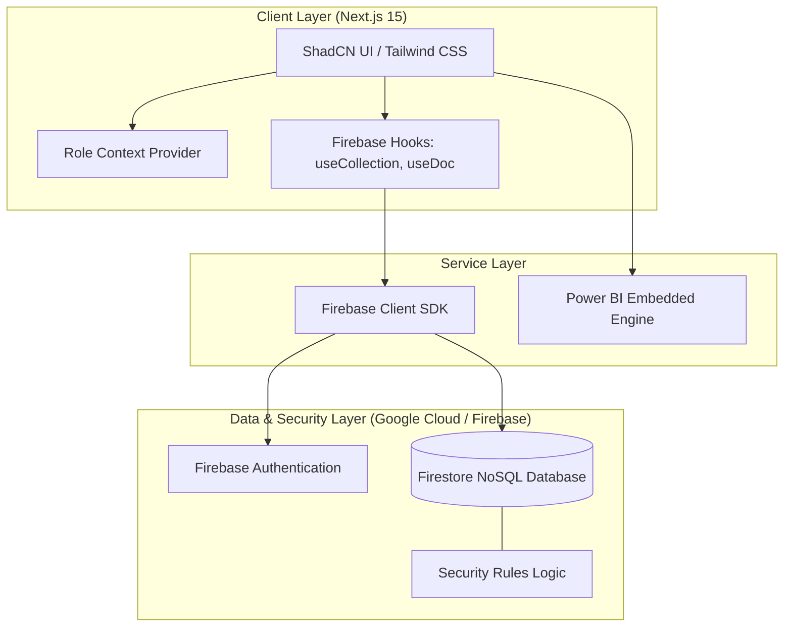

# Solution Architecture | Vinamra Jain™

This document outlines the technical architecture of the **CRM & Sales Management** platform.

## System Architecture Diagram

## Architectural Layers

### 1. Presentation Layer (Frontend)
- **Framework**: Next.js 15 (App Router) for Server-Side Rendering (SSR) and Client-Side Interactivity.
- **Styling**: Tailwind CSS for a high-density, utility-first enterprise design.
- **Components**: ShadCN UI (Radix UI primitives) for accessible, professional-grade interface elements.
- **Role Management**: A React Context-based `RoleProvider` controls component visibility and workspace access based on user persona.

### 2. Integration Layer (Firebase SDK)
- **Real-Time Streams**: The application utilizes the Firebase Web SDK to establish WebSocket connections via `onSnapshot`, ensuring data remains consistent across all user hubs without manual refreshes.
- **Error Handling**: A centralized `errorEmitter` patterns captures Firestore Permission errors and promotes them to the UI for developer/admin awareness.

### 3. Data Layer (Persistence)
- **Firestore**: A NoSQL document database structured for high-scale sales records.
- **Data Modeling**: 
    - `/customers`: Enterprise accounts.
    - `/opportunities`: Sales pipeline records.
    - `/activities`: Interaction logs.
    - `/leads`: Inbound marketing prospects.
- **Authentication**: Firebase Auth manages secure entry points for different enterprise roles.

### 4. Analytics & BI Layer
- **Operational Charts**: Native **Recharts** implementation for instantaneous performance feedback.
- **Executive Intelligence**: Secure **Power BI** integration via iframe embedding, pointing to the Vinamra Jain™ Enterprise Dashboard for board-level reporting.

***
*Architecture Documented • Vinamra Jain™ Enterprise Environment*
